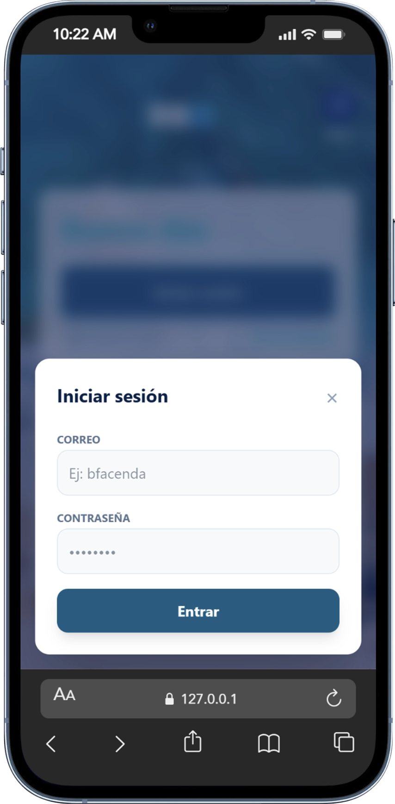

# RBO en Python 🚀

### Practica de conecion con BD y login para usuario con roles.

**RBO** es una aplicación web moderna desarrollada con **Flask** y **MariaDB**, enfocada en la gestión de usuarios y difusión de noticias. Utiliza una interfaz minimalista con estética _Glassmorphism_ mediante **Tailwind CSS**.

---

## 📸 Vista Previa

### Escritorio

<p align="center">
  
</p>

### Login y Seguridad

<p align="center">
  
</p>
---

## 🛠️ Tecnologías Utilizadas

- **Backend:** Python 3.10+ & Flask
- **Base de Datos:** MariaDB (con soporte para tipos ENUM y columnas virtuales)
- **Frontend:** Jinja2, Tailwind CSS, FontAwesome 6
- **Seguridad:** Hashing de contraseñas con `Werkzeug` (PBKDF2)

---

## 📋 Requisitos del Sistema

Para ejecutar este proyecto localmente, necesitas:

1.  Python instalado.
2.  Servidor MariaDB/MySQL activo.
3.  Instalar las dependencias:
    ```bash
    pip install flask flask-mysqldb werkzeug
    ```

---

## 🗄️ Estructura de la Base de Datos

El núcleo del sistema reside en la tabla de usuarios, diseñada para integridad de datos:

```sql
CREATE TABLE IF NOT EXISTS users (
    id INT UNSIGNED AUTO_INCREMENT PRIMARY KEY,
    dni VARCHAR(20) NOT NULL UNIQUE,
    name VARCHAR(100) NOT NULL,
    last_name VARCHAR(100) NOT NULL,
    email VARCHAR(150) NOT NULL UNIQUE,
    birthdate DATE NOT NULL,
    rol ENUM('administrador', 'usuario') DEFAULT 'usuario',
    pass VARCHAR(255) NOT NULL,
    registered_at TIMESTAMP DEFAULT CURRENT_TIMESTAMP,
    updated_at TIMESTAMP DEFAULT CURRENT_TIMESTAMP ON UPDATE CURRENT_TIMESTAMP
);
```

Desarrollado por **Bryant Facenda** - 2026
